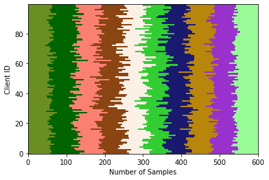
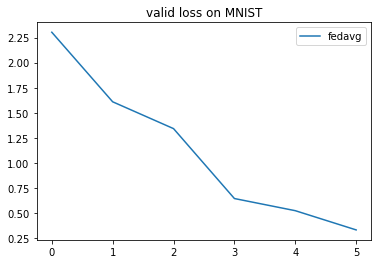

<div align="center">
  
<h1>FLGo: A Lightning Framework for Federated Learning</h1>

<!-- [](https://pypi.org/project/flgo/)
[](https://pypi.org/project/flgo/) -->
[](https://pypi.org/project/flgo/)
[](https://flgo-xmu.github.io/)
[](https://github.com/WwZzz/easyFL/blob/FLGo/LICENSE)


</div>

## Introduction
Our FLGo is a strong and reusable experimental platform for research on federated learning (FL) algorithm, which has provided a few easy-to-use modules to hold out for those who want to do various federated learning experiments. 

Welcome to our FLGo's WeChat group/QQ Group for more technical discussion.
<center class="half">


</center>


<!-- ## Major Feature -->

## Table of Contents
- [QuickStart](#QuickStart)
- [Architecture](#Architecture)
- [Citation](#Citation)
- [Contacts](#Contacts)
- [References](#References)

## QuickStart
* Install flgo
```sh
pip install flgo
```
* If the package is not found, please use the command below to update pip
```sh
pip install --upgrade pip
```
* Create Your First Federated Task

*Here we take the classical federated benchmark, Federated MNIST, as the example, where the MNIST dataset is splitted into 100 parts identically and independently.*
```
import flgo
import os
import flgo.benchmark.mnist_classification as mnist
import flgo.benchmark.partition as fbp
# the target path of the task
task_path = './my_first_task'

# generate the task if the task doesn't exist
if not os.path.exists(task_path):
    flgo.gen_task_by_(mnist, fbp.IIDPartitioner(num_clients=100), task_path)
```
*After running the codes above, a federated dataset is successfully created in the task_path. The visualization of the task is stored in **task_path/res.png** as below*



* Run FedAvg to Train Your Model
```
import flgo.algorithm.fedavg as fedavg
# create fedavg runner on the task
runner = flgo.init(task_path, fedavg, {'gpu':[0,],'log_file':True, 'num_steps':5})
runner.run()
```

* Show Training Result
  
*The training result is saved as a record under the dictionary of the task **task_path/record**. We use the built-in analyzer to read and show it.*

```
import flgo.experiment.analyzer
# create the analysis plan
analysis_plan = {
    'Selector':{'task': task_path, 'header':['fedavg',], },
    'Painter':{'Curve':[{'args':{'x':'communication_round', 'y':'val_loss'}}]},
    'Table':{'min_value':[{'x':'val_loss'}]},
}

flgo.experiment.analyzer.show(analysis_plan)
```
*We will get a figure as below*




### Reproduced FL Algorithms
| Method   |Reference|Publication| Tag|
|----------|---|---|---|
| FedAvg   |<a href='#refer-anchor-1'>[McMahan et al., 2017]</a>|AISTATS' 2017||
| FedAsync |<a href='#refer-anchor-2'>[Cong Xie et al., 2019]</a>|arxiv|Asynchronous|
| FedBuff  |<a href='#refer-anchor-3'>[John Nguyen et al., 2022]</a>|AISTATS 2022|Asynchronous|
| TiFL     |<a href='#refer-anchor-4'>[Zheng Chai et al., 2020]</a>|HPDC 2020|Communication-efficiency, responsiveness|
| AFL      |<a href='#refer-anchor-5'>[Mehryar Mohri et al., 2019]</a>|ICML 2019|Fairness|
| FedFv     |<a href='#refer-anchor-6'>[Zheng Wang et al., 2019]</a>|IJCAI 2021|Fairness|
| FedMgda+     |<a href='#refer-anchor-7'>[Zeou Hu et al., 2022]</a>|IEEE TNSE 2022|Fairness, robustness|
| FedProx     |<a href='#refer-anchor-8'>[Tian Li et al., 2020]</a>|MLSys 2020|Non-I.I.D., Incomplete Training|
| Mifa     |<a href='#refer-anchor-9'>[Xinran Gu et al., 2021]</a>|NeurIPS 2021|Client Availability|
| PowerofChoice     |<a href='#refer-anchor-10'>[Yae Jee Cho et al., 2020]</a>|arxiv|Biased Sampling, Fast-Convergence|
| QFedAvg     |<a href='#refer-anchor-11'>[Tian Li et al., 2020]</a>|ICLR 2020|Communication-efficient, Fairness|
| Scaffold     |<a href='#refer-anchor-12'>[Sai Praneeth Karimireddy et al., 2020]</a>|ICML 2020|Non-I.I.D., Communication Capacity|

### Options

Basic options:

* `task` is to choose the task of splited dataset. Options: name of fedtask (e.g. `mnist_classification_client100_dist0_beta0_noise0`).

* `algorithm` is to choose the FL algorithm. Options: `fedfv`, `fedavg`, `fedprox`, …

* `model` should be the corresponding model of the dataset. Options: `mlp`, `cnn`, `resnet18.`

Server-side options:

* `sample` decides the way to sample clients in each round. Options: `uniform` means uniformly, `md` means choosing with probability.

* `aggregate` decides the way to aggregate clients' model. Options: `uniform`, `weighted_scale`, `weighted_com`

* `num_rounds` is the number of communication rounds.

* `proportion` is the proportion of clients to be selected in each round. 

* `lr_scheduler` is the global learning rate scheduler.

* `learning_rate_decay` is the decay rate of the learning rate.

Client-side options:

* `num_epochs` is the number of local training epochs.

* `num_steps` is the number of local updating steps and the default value is -1. If this term is set larger than 0, `num_epochs` is not valid.

* `learning_rate ` is the step size when locally training.

* `batch_size ` is the size of one batch data during local training. `batch_size = full_batch` if `batch_size==-1` and `batch_size=|Di|*batch_size` if `1>batch_size>0`.

* `optimizer` is to choose the optimizer. Options: `SGD`, `Adam`.

* `weight_decay` is to set ratio for weight decay during the local training process.

* `momentum` is the ratio of the momentum item when the optimizer SGD taking each step. 

Real Machine-Dependent options:

* `seed ` is the initial random seed.

* `gpu ` is the id of the GPU device. (e.g. CPU is used without specifying this term. `--gpu 0` will use device GPU 0, and `--gpu 0 1 2 3` will use the specified 4 GPUs when `num_threads`>0. 

* `server_with_cpu ` is set False as default value,..

* `test_batch_size ` is the batch_size used when evaluating models on validation datasets, which is limited by the free space of the used device.

* `eval_interval ` controls the interval between every two evaluations. 

* `num_threads` is the number of threads in the clients computing session that aims to accelerate the training process.

* `num_workers` is the number of workers of the torch.utils.data.Dataloader

Additional hyper-parameters for particular federated algorithms:

* `algo_para` is used to receive the algorithm-dependent hyper-parameters from command lines. Usage: 1) The hyper-parameter will be set as the default value defined in Server.__init__() if not specifying this term, 2) For algorithms with one or more parameters, use `--algo_para v1 v2 ...` to specify the values for the parameters. The input order depends on the dict `Server.algo_para` defined in `Server.__init__()`.

Logger's setting

* `logger` is used to selected the logger that has the same name with this term.

* `log_level` shares the same meaning with the LEVEL in the python's native module logging.

* `log_file` controls whether to store the running-time information into `.log` in `fedtask/taskname/log/`, default value is false.

* `no_log_console` controls whether to show the running time information on the console, and default value is false.

### More

To get more information and full-understanding of FLGo please refer to <a href='https://flgo-xmu.github.io/'>our website</a>.

In the website, we offer :

- API docs: Detailed introduction of packages, classes and methods.
- Tutorial: Materials that help user to master FLGo.

## Architecture

We seperate the FL system into four parts:`algorithm`, `benchmark`, `experiment`, `fedtask`, `system_simulator` and `utils`.
```
├─ algorithm
│  ├─ fedavg.py                   //fedavg algorithm
│  ├─ ...
│  ├─ fedasync.py                 //the base class for asynchronous federated algorithms
│  └─ fedbase.py                  //the base class for federated algorithms
├─ benchmark
│  ├─ mnist_classification			//classification on mnist dataset
│  │  ├─ model                   //the corresponding model
│  |  └─ core.py                 //the core supporting for the dataset, and each contains three necessary classes(e.g. TaskGen, TaskReader, TaskCalculator)							
│  ├─ ...
│  ├─ RAW_DATA                   // storing the downloaded raw dataset
│  └─ toolkits						//the basic tools for generating federated dataset
│     ├─ cv                      // common federal division on cv
│     │  ├─ horizontal           // horizontal fedtask
│     │  │  └─ image_classification.py   // the base class for image classification
│     │  └─ ...
│     ├─ ...
│     ├─ base.py                 // the base class for all fedtask
│     ├─ partition.py            // the parttion class for federal division
│     └─ visualization.py        // visualization after the data set is divided
├─ experiment
│  ├─ logger                            //the class that records the experimental process
│  │  ├─ basic_logger.py		    	//the base logger class
│  |  └─ simple_logger.py				//a simple logger class
│  ├─ analyzer.py                  //the class for analyzing and printing experimental results
│  ├─ res_config.yml                  //hyperparameter file of analyzer.py
│  ├─ run_config.yml                  //hyperparameter file of runner.py
|  └─ runner.py                    //the class for generating experimental commands based on hyperparameter combinations and processor scheduling for all experimental 
├─ system_simulator                     //system heterogeneity simulation module
│  ├─ base.py							//the base class for simulate system heterogeneity
│  ├─ default_simulator.py				//the default class for simulate system heterogeneity
|  └─ ...
├─ utils
│  ├─ fflow.py							//option to read, initialize,...
│  └─ fmodule.py						//model-level operators
└─ requirements.txt 
```

### Benchmark

We have added many benchmarks covering several different areas such as CV, NLP, etc

<table>
    <tr>
        <td>
        <td>Task
        <td>Scenario
        <td>Datasets
        <td>
    </tr>
    <tr>
        <td rowspan=3>CV
        <td>Classification
        <td>Horizontal & Vertical
        <td>CIFAR10\100, MNIST, FashionMNIST,FEMNIST, EMNIST, SVHN
        <td>
    </tr>
    <tr>
        <td>Detection
        <td>Horizontal
        <td>Coco, VOC
        <td>
    </tr>
    <tr>
        <td>Segmentation
        <td>Horizontal
        <td>Coco, SBDataset
        <td>
    </tr>
    <tr>
        <td rowspan=3>NLP
        <td>Classification
        <td>Horizontal
        <td>Sentiment140, AG_NEWS, sst2
        <td>
    </tr>
    <tr>
        <td>Text Prediction
        <td>Horizontal
        <td>Shakespeare, Reddit
        <td>
    </tr>
    <tr>
        <td>Translation
        <td>Horizontal
        <td>Multi30k
        <td>
    </tr>
    <tr>
        <td rowspan=3>Graph
        <td>Node Classification
        <td>Horizontal
        <td>Cora, Citeseer, Pubmed
        <td>
    </tr>
    <tr>
        <td>Link Prediction
        <td>Horizontal
        <td>Cora, Citeseer, Pubmed
        <td>
    </tr>
    <tr>
        <td>Graph Classification
        <td>Horizontal
        <td>Enzymes, Mutag
        <td>
    </tr>
    <tr>
        <td>Recommendation
        <td>Rating Prediction
        <td>Horizontal & Vertical
        <td>Ciao, Movielens, Epinions, Filmtrust, Douban
        <td>
    </tr>
    <tr>
        <td>Series
        <td>Time series forecasting
        <td>Horizontal
        <td>Electricity, Exchange Rate
        <td>
    </tr>
    <tr>
        <td>Tabular
        <td>Classification
        <td>Horizontal
        <td>Adult, Bank Marketing
        <td>
    </tr>
    <tr>
        <td>Synthetic
        <td>Regression
        <td>Horizontal
        <td>Synthetic, DistributedQP, CUBE
        <td>
    </tr>
    <tr>
        <td>
        <td>
        <td>
        <td>
        <td>
    </tr>

</table>

### Fedtask

We define each task as a combination of the federated dataset of a particular distribution and the experimental results on it. The raw dataset is processed into .json file, following LEAF (https://github.com/TalwalkarLab/leaf). The architecture of the data.json file is described as below:  

```
# store the raw data
{
    'store': 'XY'
    'client_names': ['user0', ..., 'user99']
    'user0': {
       'dtrain': {'x': [...], 'y': [...]},
       'dvalid': {'x': [...], 'y': [...]},
     },...,
    'user99': {
       'dtrain': {'x': [...], 'y': [...]},
       'dvalid': {'x': [...], 'y': [...]},
     },
    'dtest': {'x':[...], 'y':[...]}
}
# store the index of data in the original dataset
{
    'store': 'IDX'
    'datasrc':{
        'class_path': 'torchvision.datasets',
        'class_name': dataset_class_name,
        'train_args': {
             'root': "str(raw_data_path)",
             ...
        },
        'test_args': {
             'root': "str(raw_data_path)",
             ...
         }
    }
    'client_names': ['user0', ..., 'user99']
    'user0': {
       'dtrain': [...],
       'dvalid': [...],
     },...,
    'dtest': [...]
}
```

Run the file `./generate_fedtask.py` to get the splited dataset (.json file).

Since the task-specified models are usually orthogonal to the FL algorithms, we don't consider it an important part in this system. And the model and the basic loss function are defined in `./task/dataset_name/model_name.py`. Further details are described in `fedtask/README.md`.

### Algorithm

This module is the specific federated learning algorithm implementation. Each method contains two classes: the `Server` and the `Client`. 


#### Server

The whole FL system starts with the `main.py`, which runs `server.run()` after initialization. Then the server repeat the method `iterate()` for `num_rounds` times, which simulates the communication process in FL. In the `iterate()`, the `BaseServer` start with sampling clients by `select()`, and then exchanges model parameters with them by `communicate()`, and finally aggregate the different models into a new one with  `aggregate()`. Therefore, anyone who wants to customize its own method that specifies some operations on the server-side should rewrite the method `iterate()` and particular methods mentioned above.

#### Client

The clients reponse to the server after the server `communicate_with()` them, who first `unpack()` the received package and then train the model with their local dataset by `train()`. After training the model, the clients `pack()` send package (e.g. parameters, loss, gradient,... ) to the server through `reply()`.     


### Experiment

The experiment module contains experiment command generation and scheduling operation, which can help FL researchers more conveniently conduct experiments in the field of federated learning.

### System_simulator

The system_simulator module is used to realize the simulation of heterogeneous systems, and we set multiple states such as network speed and availability to better simulate the system heterogeneity of federated learning parties.

### Utils

Utils is composed of commonly used operations: model-level operation (we convert model layers and parameters to dictionary type and apply it in the whole FL system). 

## Citation

Please cite our paper in your publications if this code helps your research.

```
@article{2023flgo,
  title={FLGo: A Lightning Framework for Federated Learning},
  author={},
  journal={},
  year={2023},
  publisher={}
}
```

## Contacts
Zheng Wang, zwang@stu.xmu.edu.cn

Xiaoliang Fan, fanxiaoliang@xmu.edu.cn, https://fanxlxmu.github.io

## References
<div id='refer-anchor-1'></div>

\[McMahan. et al., 2017\] [Brendan McMahan, Eider Moore, Daniel Ramage, Seth Hampson, and Blaise Aguera y Arcas. Communication-Efficient Learning of Deep Networks from Decentralized Data. In International Conference on Artificial Intelligence and Statistics (AISTATS), 2017.](https://arxiv.org/abs/1602.05629)

<div id='refer-anchor-2'></div>

\[Cong Xie. et al., 2019\] [Cong Xie, Sanmi Koyejo, Indranil Gupta. Asynchronous Federated Optimization. ](https://arxiv.org/abs/1903.03934)

<div id='refer-anchor-3'></div>

\[John Nguyen. et al., 2022\] [John Nguyen, Kshitiz Malik, Hongyuan Zhan, Ashkan Yousefpour, Michael Rabbat, Mani Malek, Dzmitry Huba. Federated Learning with Buffered Asynchronous Aggregation. In International Conference on Artificial Intelligence and Statistics (AISTATS), 2022.](https://arxiv.org/abs/2106.06639)

<div id='refer-anchor-4'></div>

\[Zheng Chai. et al., 2020\] [Zheng Chai, Ahsan Ali, Syed Zawad, Stacey Truex, Ali Anwar, Nathalie Baracaldo, Yi Zhou, Heiko Ludwig, Feng Yan, Yue Cheng. TiFL: A Tier-based Federated Learning System.In International Symposium on High-Performance Parallel and Distributed Computing(HPDC), 2020](https://arxiv.org/abs/2106.06639)

<div id='refer-anchor-5'></div>

\[Mehryar Mohri. et al., 2019\] [Mehryar Mohri, Gary Sivek, Ananda Theertha Suresh. Agnostic Federated Learning.In International Conference on Machine Learning(ICML), 2019](https://arxiv.org/abs/1902.00146)

<div id='refer-anchor-6'></div>

\[Zheng Wang. et al., 2021\] [Zheng Wang, Xiaoliang Fan, Jianzhong Qi, Chenglu Wen, Cheng Wang, Rongshan Yu. Federated Learning with Fair Averaging. In International Joint Conference on Artificial Intelligence, 2021](https://arxiv.org/abs/2104.14937#)

<div id='refer-anchor-7'></div>

\[Zeou Hu. et al., 2022\] [Zeou Hu, Kiarash Shaloudegi, Guojun Zhang, Yaoliang Yu. Federated Learning Meets Multi-objective Optimization. In IEEE Transactions on Network Science and Engineering, 2022](https://arxiv.org/abs/2006.11489)

<div id='refer-anchor-8'></div>

\[Tian Li. et al., 2020\] [Tian Li, Anit Kumar Sahu, Manzil Zaheer, Maziar Sanjabi, Ameet Talwalkar, Virginia Smith. Federated Optimization in Heterogeneous Networks. In Conference on Machine Learning and Systems, 2020](https://arxiv.org/abs/1812.06127)

<div id='refer-anchor-9'></div>

\[Xinran Gu. et al., 2021\] [Xinran Gu, Kaixuan Huang, Jingzhao Zhang, Longbo Huang. Fast Federated Learning in the Presence of Arbitrary Device Unavailability. In Neural Information Processing Systems(NeurIPS), 2021](https://arxiv.org/abs/2106.04159)

<div id='refer-anchor-10'></div>

\[Yae Jee Cho. et al., 2020\] [Yae Jee Cho, Jianyu Wang, Gauri Joshi. Client Selection in Federated Learning: Convergence Analysis and Power-of-Choice Selection Strategies. ](https://arxiv.org/abs/2010.01243)

<div id='refer-anchor-11'></div>

\[Tian Li. et al., 2020\] [Tian Li, Maziar Sanjabi, Ahmad Beirami, Virginia Smith. Fair Resource Allocation in Federated Learning. In International Conference on Learning Representations, 2020](https://arxiv.org/abs/1905.10497)

<div id='refer-anchor-12'></div>

\[Sai Praneeth Karimireddy. et al., 2020\] [Sai Praneeth Karimireddy, Satyen Kale, Mehryar Mohri, Sashank J. Reddi, Sebastian U. Stich, Ananda Theertha Suresh. SCAFFOLD: Stochastic Controlled Averaging for Federated Learning. In International Conference on Machine Learning, 2020](https://arxiv.org/abs/1910.06378)

