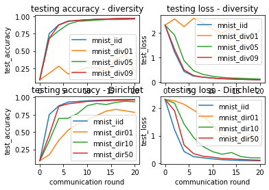

# 1.3 Task Configuration

This section introduces the definition of a federated task and how to run algorihms on different tasks in our frameworks. A federated task is defined as **optimizing an objective on a given data distribution**.

Concretely, **the objective** is defined by the dataset, the objective function, and the evaluation metrics, and each benchmark module is consist of these three terms. For example, the benchmark `flgo.benchmark.mnist_classification` requires a model to perform correct classification on hand written digits images, which is evaluated by the accuracy.

On the other hand, the **data distribution** suggests how the data is distributed among participants. For example, each participent may owns data that is identically and independently sampled from a global dataset, which is called the i.i.d. case. In our framework, `Paritioner` is responsible for creating such data distributions.

In our framework, we use the configuration of `benchmark` and `partitioner` to generate federated tasks. We now take a example to show how to write configurations to generate different data distributions on the same given benchmark.

## 1.3.1 Example: MNIST classification under different data distributions

Firstly, each config is of the type `dict` in python. The key 'benchmark' and 'partitioner' repsectively specify the information about the aforementioned benchmark and Partitioner.


```python
import flgo
flgo.set_data_root('cwd') # change the directory storing raw data to the current working directory
import flgo.benchmark.mnist_classification as mnist
import flgo.algorithm.fedavg as fedavg
import flgo.benchmark.partition
import os
# DiversityPartitioner will allocate the data to clients w.r.t. data diversity (e.g. here is label diversity)
# DirichletPartitioner will allocate the data to clients w.r.t. dirichlet distribution on specific attr. (e.g. here is also label)
config_iid = {'benchmark':mnist,'partitioner':{'name': flgo.benchmark.partition.IIDPartitioner,'para':{'num_clients':100}}}
config_div01 = {'benchmark':mnist,'partitioner':{'name': flgo.benchmark.partition.DiversityPartitioner,'para':{'num_clients':100, 'diversity':0.1}}}
config_div05 = {'benchmark':mnist,'partitioner':{'name': flgo.benchmark.partition.DiversityPartitioner,'para':{'num_clients':100, 'diversity':0.5}}}
config_div09 = {'benchmark':mnist,'partitioner':{'name': flgo.benchmark.partition.DiversityPartitioner,'para':{'num_clients':100, 'diversity':0.9}}}
config_dir01 = {'benchmark':mnist,'partitioner':{'name': flgo.benchmark.partition.DirichletPartitioner,'para':{'num_clients':100, 'alpha':0.1}}}
config_dir10 = {'benchmark':mnist,'partitioner':{'name': flgo.benchmark.partition.DirichletPartitioner,'para':{'num_clients':100, 'alpha':1.0}}}
config_dir50 = {'benchmark':mnist,'partitioner':{'name': flgo.benchmark.partition.DirichletPartitioner,'para':{'num_clients':100, 'alpha':5.0}}}
task_dict = {
    './mnist_iid': config_iid,
    './mnist_div01': config_div01,
    './mnist_div05': config_div05,
    './mnist_div09': config_div09,
    './mnist_dir01': config_dir01,
    './mnist_dir10': config_dir10,
    './mnist_dir50': config_dir50,
}

for task in task_dict:
    if not os.path.exists(task):
        flgo.gen_task(task_dict[task], task)
```

    Data root directory has successfully been changed to /home/wz/xw_d2l/Jupyter


Secondly, use FedAvg to optimize these tasks with the same hyper-parameters. Note that each benchmark will be attached with a default model (e.g. a predefined CNN for mnist_classification), and initialization without specifying model will automatically load the default model.


```python
import flgo.algorithm.fedavg as fedavg
option = {'gpu':0, 'num_rounds':20, 'num_epochs':1, 'learning_rate':0.1, 'batch_size':64, 'eval_interval':2}
runners = [flgo.init(task, fedavg, option) for task in task_dict]
for runner in runners:
    runner.run()
```


Thirdly, use `flgo.experiment.analyzer` to read the records and visuazlie the results.


```python
import flgo.experiment.analyzer as al
import matplotlib.pyplot as plt
div_recs = al.Selector({'task':[t for t in task_dict if 'iid' in t or 'div' in t], 'header':['fedavg']})

plt.subplot(221)
for task in div_recs.tasks:
    rec_list = div_recs.records[task]
    for rec in rec_list:
        plt.plot(rec.data['communication_round'], rec.data['test_accuracy'], label=task.split('/')[-1])
plt.title('testing accuracy - diversity')
plt.ylabel('test_accuracy')
plt.xlabel('communication round')
plt.legend()

plt.subplot(222)
for task in div_recs.tasks:
    rec_list = div_recs.records[task]
    for rec in rec_list:
        plt.plot(rec.data['communication_round'], rec.data['test_loss'], label=task.split('/')[-1])
plt.title('testing loss - diversity')
plt.ylabel('test_loss')
plt.xlabel('communication round')
plt.legend()

plt.subplot(223)
dir_recs = al.Selector({'task':[task for task in task_dict if 'iid' in task or 'dir' in task], 'header':['fedavg']})
for task in dir_recs.tasks:
    rec_list = dir_recs.records[task]
    for rec in rec_list:
        plt.plot(rec.data['communication_round'], rec.data['test_accuracy'], label=task.split('/')[-1])
plt.title('testing accuracy - Dirichlet')
plt.ylabel('test_accuracy')
plt.xlabel('communication round')
plt.legend()

plt.subplot(224)
dir_recs = al.Selector({'task':[task for task in task_dict if 'iid' in task or 'dir' in task], 'header':['fedavg']})
for task in dir_recs.tasks:
    rec_list = dir_recs.records[task]
    for rec in rec_list:
        plt.plot(rec.data['communication_round'], rec.data['test_loss'], label=task.split('/')[-1])
plt.title('testing loss - Dirichlet')
plt.ylabel('test_loss')
plt.xlabel('communication round')
plt.legend()
plt.show()
```



