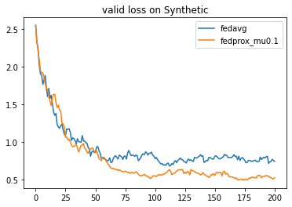
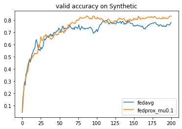

# 1.4 Algorithm Configuration

This section introduces how to change algorithms on the same federated task. In our framework, the algorithm object describes the behaviors of participants in the FL system. For example, the server of horizontal FL usually samples clients, broadcasts the global model to them, and aggregates the collected models from them, where there exist a plenty of different strategies to improve each step. Now we compare a heterogeneous-aware FL algorithm, FedProx, against FedAvg under the same task to show the usage of algorihm.

## 1.4.1 Example: Comparison on FedAvg and FedProx

### Dataset: Synthetic(0.5, 0.5)

We conduct the experiments that shares the same setting in []. Firstly, we generate synthetic datasets with 30 clients. This dataset is generated by

$$y_{k,i}=\text{argmax}\{softmax({W_k} x_{k,i}+ b_k)\}$$

where $(x_{k,i}, y_{k,i})$ is the $i$th example in the local data $D_k$ of client $c_k$. For each client $c_k$, its local optimal model parameter $(W_k, b_k)$ is generated by $\mu_k\sim \mathcal{N}(0,\alpha)\in \mathbb{R},W_{k}[i,j]\sim\mathcal{N}(\mu_k,1),  W_k\in \mathbb{R}^{10\times 60}, b_{k}[i]\sim\mathcal{N}(\mu_k,1), b_k\in\mathbb{R}^{10}$, and its local data distribution is generated by $B_k\sim\mathcal{N}(0,\beta),  v_k[i]\sim\mathcal{N}(B_k,1),  v_k\in \mathbb{R}^{60}, x_{k,i}\sim\mathcal{N}(v_k, \Sigma)\in \mathbb{R}^{60},\Sigma=\text{diag}(\{i^{-1.2}\}_{i=1}^{60})$. Here we conduct experiments on Synthetic(0.5,0.5) where $\alpha=\beta=0.5$.


```python
import os
import flgo
task = './test_synthetic'
config = {'benchmark':{'name':'flgo.benchmark.synthetic_regression', 'para':{'alpha':0.5, 'beta':0.5, 'num_clients':30}}}
if not os.path.exists(task): flgo.gen_task(config, task_path = task)
```

    Task ./test_synthetic has been successfully generated.


### Running two algorithms


```python
import flgo.algorithm.fedprox as fedprox
import flgo.algorithm.fedavg as fedavg

option = {'num_rounds':200, 'num_epochs':5, 'batch_size':10, 'learning_rate':0.1, 'gpu':0}
fedavg_runner = flgo.init(task, fedavg, option=option)
fedprox_runner = flgo.init(task, fedprox, option=option)
fedavg_runner.run()
fedprox_runner.run()
```

### Plot the results


```python
import flgo.experiment.analyzer
analysis_plan = {
    'Selector':{
        'task': task,
        'header':['fedavg', 'fedprox']
    },
    'Painter':{
        'Curve':[
            {'args':{'x': 'communication_round', 'y':'val_loss'}, 'fig_option':{'title':'valid loss on Synthetic'}},
            {'args':{'x': 'communication_round', 'y':'val_accuracy'},  'fig_option':{'title':'valid accuracy on Synthetic'}},
        ]
    }
}
flgo.experiment.analyzer.show(analysis_plan)
```








The result tells that FedProx has superior performance than FedAvg under this setting of data heterogeneity.