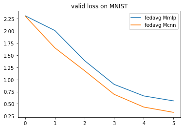
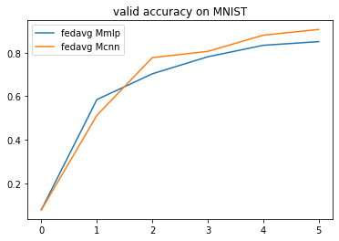
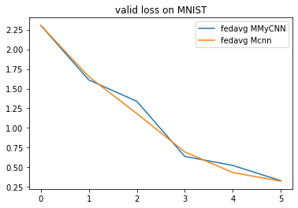
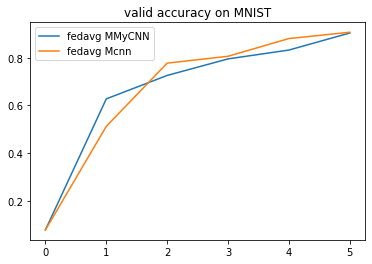
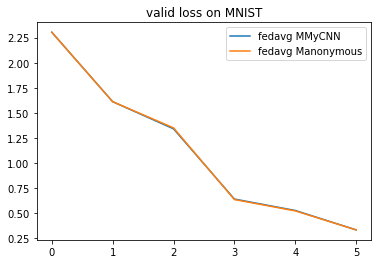
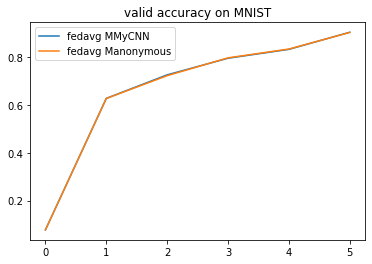

# 1.5 Model Configuration

This section introduces how to change the model. Far now, we only train the default model for each benchmark (e.g. CNN for mnist_classification). For most of the benchmarks, we have provided several popular models that can be easily used by replacing the parameter **model** in `flgo.init`. We show the usage by the following example.

## 1.5.1 Example: Select model for MNIST


```python
import flgo.benchmark.mnist_classification.model.cnn as cnn
import flgo.benchmark.mnist_classification.model.mlp as mlp
import flgo.algorithm.fedavg as fedavg
task = './mnist_iid' # this task has been generated in Example 2.1
cnn_runner = flgo.init(task, fedavg, option={'num_rounds':5, 'num_epochs':1, 'gpu':0}, model=cnn)
mlp_runner = flgo.init(task, fedavg, option={'num_rounds':5, 'num_epochs':1, 'gpu':0}, model=mlp)
cnn_runner.run()
mlp_runner.run()

# result analysis
import flgo.experiment.analyzer
analysis_plan = {
    'Selector':{
        'task': task,
        'header':['fedavg'],
        'filter':{'M':['cnn', 'mlp'], 'R':5}, # filter the result by the communication round R=5
        'legend_with':['M']
    },
    'Painter':{
        'Curve':[
            {'args':{'x': 'communication_round', 'y':'val_loss'}, 'fig_option':{'title':'valid loss on MNIST'}},
            {'args':{'x': 'communication_round', 'y':'val_accuracy'},  'fig_option':{'title':'valid accuracy on MNIST'}},
        ]
    }
}
flgo.experiment.analyzer.show(analysis_plan)
```








## 1.5.2 Customization on models

We now discuss the impletementation of models in our framework. Different from the centralized ML setting where there is only a model that transform the input to the output, the **model** in our framework should describe what and how the models are kept by different participants. This is because different parties in FL may have models with different architectures and paramters (e.g. personzalized FL, vertical FL, model-agnostic FL). In addition, the model sometimes could also be a significant part of particular methods. Therefore, we define the model as a class as follows:


```python
class GeneralModel:
    @classmethod
    def init_local_module(cls, object):
        """init local models (e.g. personal models that cannot be shared) for the object according to its information"""
        pass

    @classmethod
    def init_global_module(cls, object):
        """init global models (e.g. sharable models) for the object according to its information"""
        pass
```

Now we construct a model and test it as the example.


```python
from torch import nn
import torch.nn.functional as F
from flgo.utils.fmodule import FModule

class CNNModel(FModule): # inherit from flgo.utils.fmodule.FModule instead of torch.nn.Module
    def __init__(self):
        super().__init__()
        self.conv1 = nn.Conv2d(in_channels=1, out_channels=32, kernel_size=5, padding=2)
        self.conv2 = nn.Conv2d(in_channels=32, out_channels=64, kernel_size=5, padding=2)
        self.fc1 = nn.Linear(3136, 512)
        self.fc2 = nn.Linear(512, 10)

    def forward(self, x):
        x = x.view((x.shape[0],28,28))
        x = x.unsqueeze(1)
        x = F.max_pool2d(F.relu(self.conv1(x)), 2)
        x = F.max_pool2d(F.relu(self.conv2(x)), 2)
        x = x.view(-1, x.shape[1]*x.shape[2]*x.shape[3])
        x = F.relu(self.fc1(x))
        x = self.fc2(x)
        return x

def init_local_module(object):
    pass

def init_global_module(object):
    # In classical horizontal FL, only the server needs to trace the latest global and store it
    if 'Server' in object.get_classname():
        object.model = CNNModel().to(object.device)

class MyCNN:
    init_local_module = init_local_module
    init_global_module = init_global_module

mycnn_runner = flgo.init(task, fedavg, option={'num_rounds':5, 'num_epochs':1, 'gpu':0}, model=MyCNN)
mycnn_runner.run()

analysis_plan = {
    'Selector':{
        'task': task,
        'header':['fedavg'],
        'filter':{'M':['MyCNN', 'cnn'], 'R':5},
        'legend_with':['M']
    },
    'Painter':{
        'Curve':[
            {'args':{'x': 'communication_round', 'y':'val_loss'}, 'fig_option':{'title':'valid loss on MNIST'}},
            {'args':{'x': 'communication_round', 'y':'val_accuracy'},  'fig_option':{'title':'valid accuracy on MNIST'}},
        ]
    }
}
flgo.experiment.analyzer.show(analysis_plan)
```








The two CNNs of the same architecture has a similar performance in this example.

## 1.5.3 What is FModule?

`FModule` is a class that decorates the class `torch.nn.Module` to enable direct operations on models like add, sub. `FModule` directly inherits from `torch.nn.Module` and won't have any impact on its original characteristics. The only difference lies in that `FModule` allows the model-level operations by using operators +,-,* to obtain a new model. We show the usage of `FModule` by the following example.

### 1.5.3.1 Example: Model-level operators


```python
from torch import nn
import torch.nn.functional as F
from flgo.utils.fmodule import FModule

class Model(FModule):
    def __init__(self):
        super().__init__()
        self.fc = nn.Linear(3, 3, bias=False)

    def forward(self, x):
        return x

A = Model()
B = Model()
```


```python
print("model A: ", A.fc.weight)
print("model B: ", B.fc.weight)

# add
C = A+B # C is a new instance of class Model and changes on C won't have any impact on A or B
print("C=A+B: {}", C.fc.weight)
print("Type of C:",C)
```

    model A:  Parameter containing:
    tensor([[ 0.2429, -0.4990,  0.1843],
            [-0.2553,  0.1664,  0.3536],
            [ 0.5772,  0.0578, -0.0694]], requires_grad=True)
    model B:  Parameter containing:
    tensor([[-0.4220, -0.3707, -0.2508],
            [-0.4888, -0.1267,  0.1310],
            [ 0.5714, -0.2370,  0.3410]], requires_grad=True)
    C=A+B: {} Parameter containing:
    tensor([[-0.1790, -0.8697, -0.0665],
            [-0.7441,  0.0397,  0.4845],
            [ 1.1486, -0.1792,  0.2716]], requires_grad=True)
    Type of C: Model(
      (fc): Linear(in_features=3, out_features=3, bias=False)
    )


```python
# sub
print('A-B: \n', (A-B).fc.weight)
print('+++++++++++++++++++++++++++++++++++')
# scale
print('2*A: \n', (2*A).fc.weight)
print('+++++++++++++++++++++++++++++++++++')
# div
print('A/2: \n', (A/2).fc.weight)
print('+++++++++++++++++++++++++++++++++++')
# norm
print('||A||_2: \n', (A**2))
print('+++++++++++++++++++++++++++++++++++')
# neg
print('-A: \n', (-A).fc.weight)
print('+++++++++++++++++++++++++++++++++++')
# zeros-copy
print('A.zeros_like(): \n',A.zeros_like().fc.weight)
print('+++++++++++++++++++++++++++++++++++')
# dot
print("dot(A,B):\n", A.dot(B))
print('+++++++++++++++++++++++++++++++++++')
# cos-similarity
print("cos_sim(A,B):\n", A.cos_sim(B))
print('+++++++++++++++++++++++++++++++++++')
# size
print("size(A):\n", A.count_parameters())
print('+++++++++++++++++++++++++++++++++++')
```

    A-B:
     Parameter containing:
    tensor([[ 0.6649, -0.1282,  0.4352],
            [ 0.2336,  0.2932,  0.2226],
            [ 0.0057,  0.2948, -0.4103]], requires_grad=True)
    +++++++++++++++++++++++++++++++++++
    2*A:
     Parameter containing:
    tensor([[ 0.4859, -0.9979,  0.3687],
            [-0.5105,  0.3329,  0.7072],
            [ 1.1543,  0.1156, -0.1388]], requires_grad=True)
    +++++++++++++++++++++++++++++++++++
    A/2:
     Parameter containing:
    tensor([[ 0.1215, -0.2495,  0.0922],
            [-0.1276,  0.0832,  0.1768],
            [ 0.2886,  0.0289, -0.0347]], requires_grad=True)
    +++++++++++++++++++++++++++++++++++
    ||A||_2:
     tensor(0.9493)
    +++++++++++++++++++++++++++++++++++
    -A:
     Parameter containing:
    tensor([[-0.2429,  0.4990, -0.1843],
            [ 0.2553, -0.1664, -0.3536],
            [-0.5772, -0.0578,  0.0694]], requires_grad=True)
    +++++++++++++++++++++++++++++++++++
    A.zeros_like():
     Parameter containing:
    tensor([[0., -0., 0.],
            [-0., 0., 0.],
            [0., 0., -0.]], requires_grad=True)
    +++++++++++++++++++++++++++++++++++
    dot(A,B):
     tensor(0.4787)
    +++++++++++++++++++++++++++++++++++
    cos_sim(A,B):
     tensor(0.4703)
    +++++++++++++++++++++++++++++++++++
    size(A):
     9
    +++++++++++++++++++++++++++++++++++


Besides the model-level operators, we also implement some common functions on model-level.


```python
import flgo.utils.fmodule as ff
# exp(A)
print('exp(A):\n', ff.exp(A).fc.weight)
print('+++++++++++++++++++++++++++++++++++')
# log(A)
print('log(A):\n', ff.log(A).fc.weight)
print('+++++++++++++++++++++++++++++++++++')
# model to 1-D vector
a = ff._model_to_tensor(A)
print('a = Vec(A):\n', a)
# 1-D tensor to model
print('A from a: \n',ff._model_from_tensor(a, A.__class__).fc.weight)
print('+++++++++++++++++++++++++++++++++++')
# model averaging
print('AVERAGE([A,B]):\n', ff._model_average([A,B]).fc.weight)
# model sum
print('SUM([A,B]):\n', ff._model_sum([A,B]).fc.weight)
```

    exp(A):
     Parameter containing:
    tensor([[1.2750, 0.6072, 1.2024],
            [0.7747, 1.1811, 1.4242],
            [1.7810, 1.0595, 0.9330]], requires_grad=True)
    +++++++++++++++++++++++++++++++++++
    log(A):
     Parameter containing:
    tensor([[-1.4149,     nan, -1.6910],
            [    nan, -1.7931, -1.0396],
            [-0.5496, -2.8510,     nan]], requires_grad=True)
    +++++++++++++++++++++++++++++++++++
    a = Vec(A):
     tensor([ 0.2429, -0.4990,  0.1843, -0.2553,  0.1664,  0.3536,  0.5772,  0.0578,
            -0.0694])
    A from a:
     Parameter containing:
    tensor([[ 0.2429, -0.4990,  0.1843],
            [-0.2553,  0.1664,  0.3536],
            [ 0.5772,  0.0578, -0.0694]], requires_grad=True)
    +++++++++++++++++++++++++++++++++++
    AVERAGE([A,B]):
     Parameter containing:
    tensor([[-0.0895, -0.4348, -0.0333],
            [-0.3721,  0.0199,  0.2423],
            [ 0.5743, -0.0896,  0.1358]], requires_grad=True)
    SUM([A,B]):
     Parameter containing:
    tensor([[-0.1790, -0.8697, -0.0665],
            [-0.7441,  0.0397,  0.4845],
            [ 1.1486, -0.1792,  0.2716]], requires_grad=True)


## 1.5.4 Fast Customization

We further provide fast API to convert a model into federated one by writing only one line code


```python
from torch import nn
import torch.nn.functional as F

class NewModel(nn.Module):
    def __init__(self):
        super().__init__()
        self.conv1 = nn.Conv2d(in_channels=1, out_channels=32, kernel_size=5, padding=2)
        self.conv2 = nn.Conv2d(in_channels=32, out_channels=64, kernel_size=5, padding=2)
        self.fc1 = nn.Linear(3136, 512)
        self.fc2 = nn.Linear(512, 10)

    def forward(self, x):
        x = x.view((x.shape[0],28,28))
        x = x.unsqueeze(1)
        x = F.max_pool2d(F.relu(self.conv1(x)), 2)
        x = F.max_pool2d(F.relu(self.conv2(x)), 2)
        x = x.view(-1, x.shape[1]*x.shape[2]*x.shape[3])
        x = F.relu(self.fc1(x))
        x = self.fc2(x)
        return x

model = flgo.convert_model(NewModel) # the default value of model_name is 'anonymous'
mycnn_runner2 = flgo.init(task, fedavg, option={'num_rounds':5, 'num_epochs':1, 'gpu':0}, model=model)
mycnn_runner2.run()

analysis_plan = {
    'Selector':{
        'task': task,
        'header':['fedavg'],
        'filter':{'M':['MyCNN', 'anonymous'], 'R':5},
        'legend_with':['M']
    },
    'Painter':{
        'Curve':[
            {'args':{'x': 'communication_round', 'y':'val_loss'}, 'fig_option':{'title':'valid loss on MNIST'}},
            {'args':{'x': 'communication_round', 'y':'val_accuracy'},  'fig_option':{'title':'valid accuracy on MNIST'}},
        ]
    }
}
flgo.experiment.analyzer.show(analysis_plan)
```






